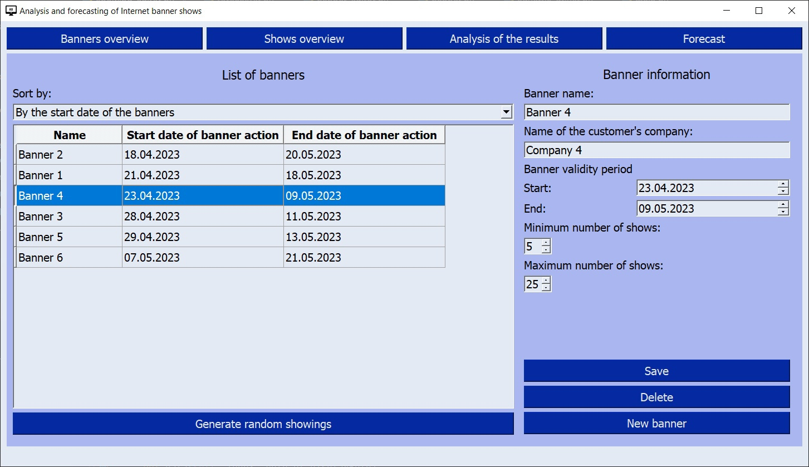
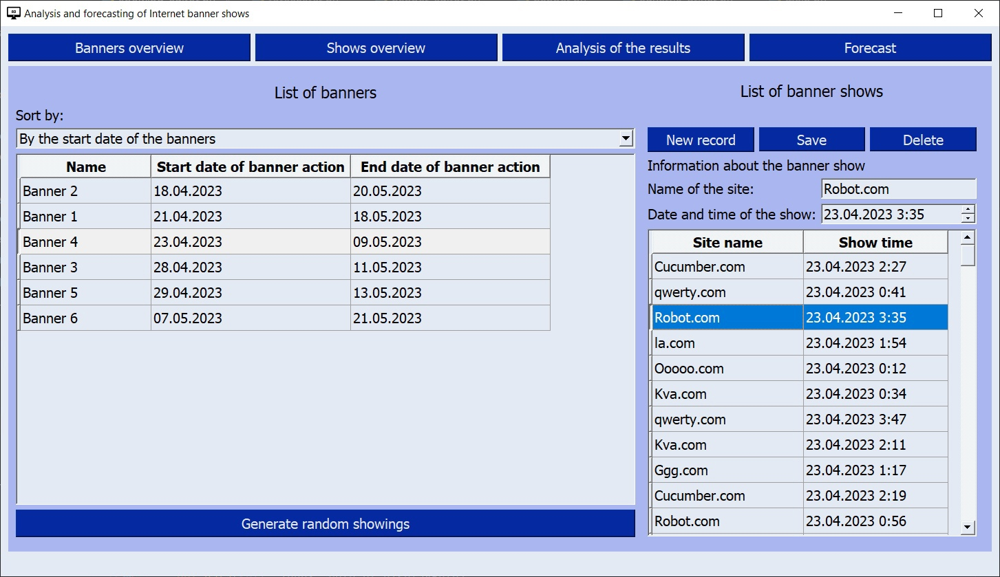
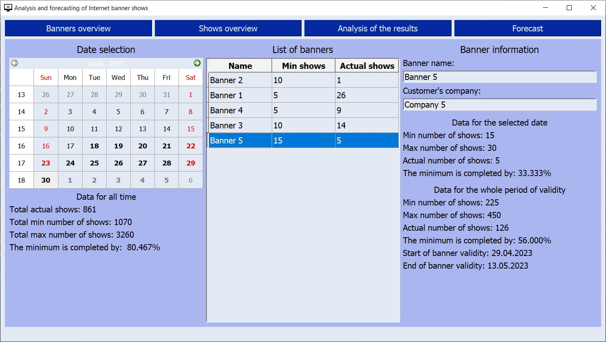
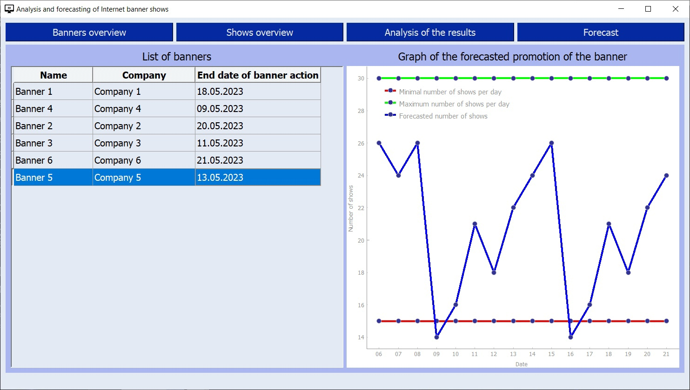

# Accounting for results of advertising

## Table of contents
* [Introduction](#introduction)
* [Technologies](#technologies)
* [Tools](#tools)
* [Installation](#installation)
  * [Program dependencies](#program-dependencies)
  * [Program installation](#program-installation)
* [Features](#features)
  * [Banners overview](#banners-overview)
  * [Shows overview](#shows-overview)
  * [Analysis of the results](#analysis-of-the-results)
  * [Banner show forecasting](#banner-show-forecasting)

<a name="introduction"></a>
## Introduction

The program is designed to analyze the results of 
the promotion of Internet advertising banners and 
predict their promotion in the future.
I developed this project in order to study new technologies and tools. 

The user of the program can: 
* edit banner data
* edit banner impressions records
* view statistics on banner impressions for the selected date or for the entire time
* view the forecast of impressions for each banner

<a name="technologies"></a>
## Technologies
* Python 3.10
* PyQt5 - set of Python libraries for creating a graphical interface
* PyQtGraph - graphics and user interface library for Python
* SQLite - compact embedded DBMS

<a name="tools"></a>
## Tools
* Python interpreter
* PyCharm IDE
* Qt Designer - environment for developing graphical interfaces
* DB Browser (SQLite) - tool for creating, designing and editing SQLite-compatible database files
* Git - distributed version control system

<a name="installation"></a>
## Installation
<a name="program-dependencies"></a>
### Program dependencies
To start the project, run the commands
```commandline
pip install pyqt5
pip install pyqtgraphics
```

<a name="program-installation"></a>
### Program installation 
1. Clone the repository:
```commandline
git clone ....
```
2. Install dependencies:
```commandline
pip install pyqt5
pip install pyqtgraph
```
3. Run the application:
```commandline
python main.py
```

___
<a name="features"></a>
## Features
<a name="banners overview"></a>
### Banners overview
In the "Banners overview" tab user can:
* add new banner
* delete a selected banner
* edit a selected banner
* sort the list of banners by date of start or by date of expiration
* generate random data to test the program

To add a new banner:
1. Click the "New banner" button.
2. Enter the information of the new banner.
3. Click the "Save" button.

To edit a banner:
1. Select a banner from the list.
2. Edit the banner information.
3. Click the "Save" button.

To delete a banner:
1. Select a banner from the list.
2. Click the "Delete" button.


___
<a name="shows overview"></a>
### Shows overview
In the "Shows overview" tab user can:
* add a new banner show record
* delete the selected record
* edit the selected record
* sort the list of banners by date of start or by date of expiration
* generate random data to test the program

To add a new banner show record:
1. Select a banner.
2. Click the "New record" button.
3. Enter the details of the new banner show.
4. Click the "Save" button.

To edit the banner show record:
1. Select a banner from the list.
2. Select this banner show record from the list.
3. Edit the banner show information.
4. Click the "Save" button.

To delete a banner show record:
1. Select a banner from the list.
2. Select a banner show record from the list.
3. Press the "Delete" button.


___
<a name="analisys"></a>
### Analysis of the results
In the "Analysis of the results" tab user can:
* view the results of promotion of all banners for all time
* view the results of promotion of one banner on the selected date
* view the results of promotion of one banner for all time

To view information about a banner:
1. Select a date on the calendar.
2. Select a banner from the list of banners displayed.
3. The banner information for the selected date and all time is displayed to the right of the list.


___
<a name="forecasting"></a>
### Banner show forecasting
On the "Forecast" tab user can view the show forecast for a particular banner.

